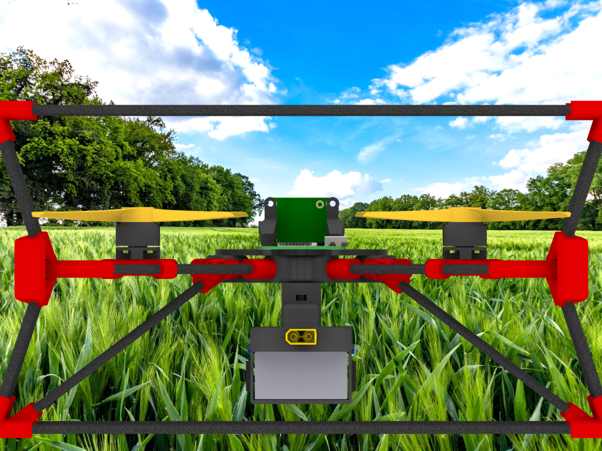

# The CogniFly Project

Welcome to the main website for [The CogniFly Project](https://github.com/thecognifly)! 

Here we are building [open-source](LICENSE) autonomous flying robots that are robust to collisions and easy to build, weight less than 250g, designed to have the battery automatically swapped by an external platform and yet capable of collecting data and running machine learning models *on-the-fly*.

## Why did we decide to create yet another drone design?
It all started when the then [MISTLab](http://mistlab.ca/) postdoctoral researcher, [Ricardo de Azambuja](https://github.com/ricardodeazambuja), was awarded with the prestigious [IVADO.ca (postdoctoral scholarship 2019/2020)](https://ivado.ca/en/ivado-scholarships/postdoctoral-scholarships/) for the project ["High Fidelity Data Collection for Precision Agriculture with Drone Swarms"](https://ricardodeazambuja.com/projects/razambuja_ivado2019/). That project was originally planning to employ *off-the-shelf* drones, more precisely the [DJI Tello](https://store.dji.com/product/tello) with the hope it would be possible to customize it and control a swarm using [Buzz](https://github.com/MISTLab/Buzz). However, as soon as the project started, it became clear we wanted a drone capable to be as autonomous as possible running Buzz internally, therefore, a drone that needed to be hooked to a laptop was not what we were aiming for. By the time the project started (March 2019), regulations in Canada would put harsh restrictions on drones above 250g. Moreover, we wanted an *AI* drone capable to run deep neural models (e.g. object detection) on-board because that was a main part of our initial proposal. Another reason to jump into the design of a totally new [UAV](https://en.wikipedia.org/wiki/Unmanned_aerial_vehicle) was our dream of having an open-source design, under 250g that could be easily repaired or customized with a battery holder that would allow the battery to be automatically swapped. 

## The CogniFly
CogniFly is based on small, lightweight off-the-shelf flight controllers (FC) that became very popular (and cheap!) thanks to the FPV drone community (and some massive hardware cloning). A FC is mainly responsible to keep the drone stable by calculating motor speed commands based on the data received from sensors like the [IMU](https://en.wikipedia.org/wiki/Inertial_measurement_unit). Those commands, in the case of a [quadcopter](https://en.wikipedia.org/wiki/Quadcopter), go straight to the [ESC](https://en.wikipedia.org/wiki/Electronic_speed_control) that converts them into something that actually makes the [motors spin accordingly](https://en.wikipedia.org/wiki/Quadcopter#Flight_dynamics). Some FCs (actually just by changing the firmware) are capable of following certain paths (waypoints) if they have an external positioning sensor (e.g. a [GPS](https://en.wikipedia.org/wiki/Global_Positioning_System)). However, a FC alone can not do much more than that and an external pilot needs to take a lot of decisions and send commands to the FC typically from a joystick-like device that transmits the commands commonly through radio signals. The external pilot doesn't need to be a human being and, in fact, it doesn't need to send commands through radio signals either (it could be through a cable). CogniFly uses a single-board computer (SBC), in this case a [Raspberry Pi (RPI) Zero W](https://www.raspberrypi.org/products/raspberry-pi-zero-w/), that pretends to be the external pilot. 

The RPI sits on the top of the drone and it's wired to the FC through its serial port ([UART](https://en.wikipedia.org/wiki/Universal_asynchronous_receiver-transmitter), to be more precise) after passing it through a [level shifter](https://en.wikipedia.org/wiki/Level_shifter) (remember, the [RPI uses 3.3V](https://www.raspberrypi-spy.co.uk/2018/09/using-a-level-shifter-with-the-raspberry-pi-gpio/) levels while most FCs seem to use 5V). In addition to the RPI, we also use [a sensor](http://www.mateksys.com/?portfolio=3901-l0x) that provides altitude ([Time-of-Flight sensor](https://www.terabee.com/time-of-flight-principle/)) and relative odometry ([optical flow](https://en.wikipedia.org/wiki/Optical_flow) sensor) allowing the FC to keep the drone in a fixed position thus transforming the pilot's task into a high level one. Some extra nice advantages of using a RPI Zero W as the SBC is the [huge community](https://magpi.raspberrypi.org/articles/raspberry-pi-sales) around it and easy access to WiFi and Bluetooth out of the box together with SPI, I2C, UART, PWM, etc. In order to allow the RPI to control the drone we developed a special [Python3](https://www.python.org/doc/sunset-python-2/) library called [YAMSPy](https://github.com/thecognifly/YAMSPy) that *speaks* the [MultiWii](https://github.com/multiwii) protocol and can send commands and read information from a FC running [iNAV](https://github.com/iNavFlight/inav) or [Betaflight](https://github.com/betaflight/betaflight). 

By choosing to use a RPI as the SBC we openned up many possibilities for the AI side of this project because it's very easy to interface external hardware to the RPI like the [AI Vision Kit](https://aiyprojects.withgoogle.com/vision), [Coral EdgeTPU USB Accelerator](https://github.com/ricardodeazambuja/libedgetpu-rpi0/releases/tag/rpi0_tflite_edgetpu) ([or simply run TensorFlow Lite directly](https://www.tensorflow.org/lite/guide/build_rpi)) and there're already some examples available. After studying possible hardware accelerators for running inference on the edge that were small and lightweight enough (remember the 250g limit), we ended up with these three options: [JeVois](http://jevois.org/), [Google AIY Vision Kit](https://aiyprojects.withgoogle.com/vision/) and [Google Coral EdgeTPU USB](https://coral.ai/products/accelerator/). So far we have successfully tested Google's AIY Vision Kit because it interfaces very nicely with the RPI Zero W, [it gives us access to extra GPIO pins (with ADC and PWM)](https://aiyprojects.readthedocs.io/en/latest/vision.html#vision-bonnet) and even a [crypto chip](https://www.microchip.com/wwwproducts/en/ATECC608A), but we have plans to test the other options in the near future ([see this repo for EdgeTPU USB on the RPI Zero](https://github.com/ricardodeazambuja/libedgetpu-rpi0/releases/tag/rpi0_tflite_edgetpu)).

In addition to the electronic boards, battery, motors and propellers, a quadcopter needs a frame where all the parts are held together. Nowadays, the most common solution is a carbon fiber sheet that is machined to a certain shape (usually something resembling a 'X') with holes for connecting motors and the FC. However, our aim was to design a customizable frame that could be easily 3D printed by any small hobby grade machine (e.g. [Tinyboy Education Project](https://www.tinyboy.net/)). The reason for that was to allow us to modify or fix the drone easily and iterate the design faster since we already had a small printer available (an [MP Select Mini V2](https://www.monoprice.com/product?p_id=21711)). 

As the project progressed, we rapidly faced the fact that experimental drones crash a lot more than what we were used to when flying off-the-shelf ones. However, not only the frame needs to withstand daily (hourly...) crashes. An experimental design ideally requires some protection to propellers and other components to avoid breaking things each time an accident occurs. Additionally to protecting the more vulnerable parts from direct impacts, it's necessary to avoid abrupt (de)acceleration during impacts because that stress can cause all sorts of components to fail prematurely too.

Nature probably had these problems during its evolutional design process. Bees are a cool example of nature's design choices. YouTube is full of videos where [bees crash land](https://www.youtube.com/watch?v=A4mcsi_DHKA) or simply [hit each other while they are flying](https://youtu.be/mZhwK_y3a2Y?t=23) clearly without dying or breaking anything. We definitely are not the first ones to take notice of [bees funny flying behaviours](https://spectrum.ieee.org/automaton/robotics/drones/the-secret-to-small-drone-obstacle-avoidance-is-to-just-crash-into-stuff) and, to be fair, the whole idea of being somehow soft while crashing [seens to come from the 30's](https://en.wikipedia.org/wiki/Crumple_zone#Early_development_history). However, one stricking difference between what bees do and crumple zones is that bees come out intact from the incidents while crumple zones dissipate the energy by destroying themselves.

Our current design mixes soft and hard materials thus making CogniFly a drone capable of stunts that are quite unique while keeping its total weight just under 250g. Below is depicted the latest build with motion capture markers attached to it.

<!-- ## Design evolution, or lessons learned
We went through many iterations before we found the sweet spot. The animation below shows since the very first design until the latest one using 3D printed flexible net: 
 -->
## Useful links
- [YAMSPy](https://github.com/thecognifly/YAMSPy)
- [CogniFly-STL](https://github.com/thecognifly/CogniFly-STL)
- [iNav Fork customized for CogniFly](https://github.com/thecognifly/inav/tree/CogniFly)
- [How to train your own object detector using the AIY Vision Kit](https://github.com/thecognifly/AIY-Vision-Kit-Utils)
- [How to use docker to speed up compilation for the RPI Zero](https://ricardodeazambuja.com/rpi/2020/12/29/rpi2docker/)
## Publications
Soon!

## Acknowledgements
The CogniFly Project is built around many other succesful open-source projects starting by [Linux itself](https://www.linuxfoundation.org/). Therefore, it would be impossible to cite all projects here and we appologize beforehand because we are going, for sure, forget to cite many: the flight controllers used in this project run [iNAV](https://github.com/iNavFlight/inav) or [Betaflight](https://github.com/betaflight/betaflight) (and those projects themselves only exist because there was a [MultiWii project](https://github.com/multiwii) before them). The RPI Zero W image was based on the one supplied by [Google AIY Projects](https://github.com/google/aiyprojects-raspbian). Many ideas for the code probably are from [stackoverflow](http://stackoverflow.com/) and inspiration to YAMSPy definitely came from my friend Aldo's [pyMultiWii](https://github.com/alduxvm/pyMultiWii). The [PiDrone project](https://github.com/h2r/pidrone_pkg) and [Pidrone (yup, same names!)](https://github.com/PiStuffing/Quadcopter) also gave us a lot of inspiration since they where using RPI 3 to control drones. Thanks to the wonderful [Raspiberry Pi Foundation](https://www.raspberrypi.org/) we have an affordable and small single-board computer (the Raspberry Pi Zero W). Nowadays 3D printers are only accessible to so many people because of the [RepRap project](https://reprap.org/wiki/RepRap).

Many people from [MISTLab](http://mistlab.ca/) helped during the development of this project, so a big thanks goes to the whole team.

This work was only possible thanks to the financial support from [IVADO.ca (postdoctoral scholarship 2019/2020)](https://ivado.ca/en/ivado-scholarships/postdoctoral-scholarships/).
